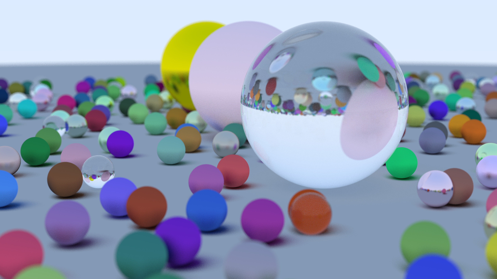
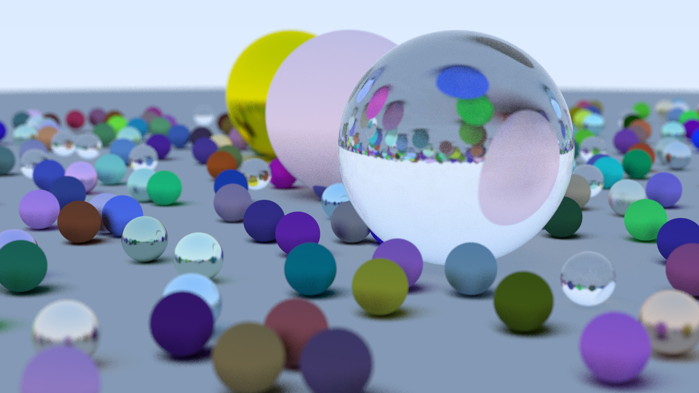

# Ray Tracing in one weekend
### Based on [_Ray Tracing in One Weekend_](https://raytracing.github.io/books/RayTracingInOneWeekend.html)
*Windows only*

## Examples



## Diff
- Added simple multithreading.
- Changed code structure.
- Better RNG.

## Installation
- Clone git repo.
- Open project with IDE like MS Visual Studio or JetBrains Rider.
- Build project with preferred configuration.

## Run
You can specify image size and thread count in `Common\Config.h` file. 
Default values are `1920x1080` for image size and `90` threads.

To generate `ppm` image, find .exe file in bin directory and run in `cmd` or `PowerShell`:  
``` 
ray_tracing_in_one_weekend.exe > image.ppm 
```

